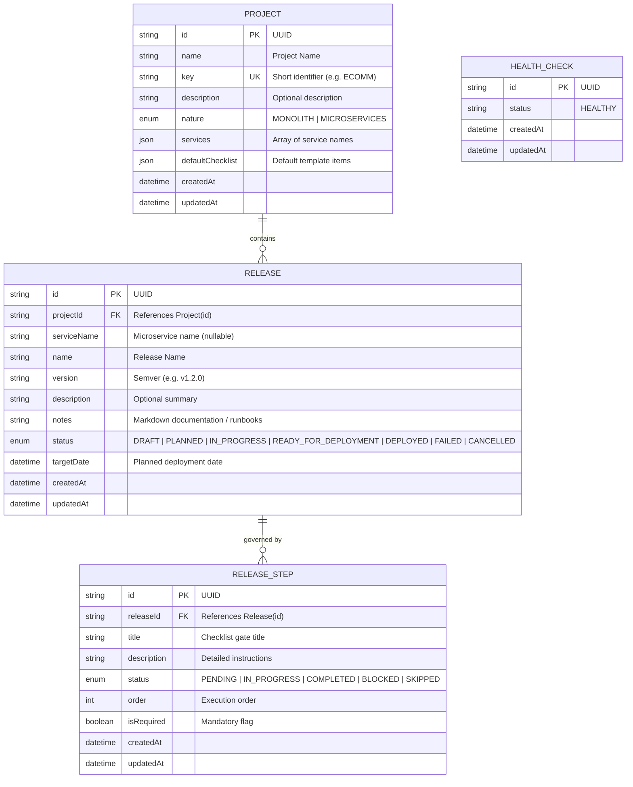

# 🚀 Release Checklist & Governance Platform

A modern, production-grade full-stack **Release Checklist Platform** designed to help engineering teams govern, verify, and orchestrate software releases across architectures.

---

## 📑 Table of Contents

1. [Architectural Overview & Design Decisions](#1-architectural-overview--design-decisions)
2. [Database Schema (PostgreSQL)](#2-database-schema-postgresql)
3. [GraphQL API Reference](#3-graphql-api-reference)
4. [Tech Stack](#4-tech-stack)
5. [Local Development & Docker Setup](#5-local-development--docker-setup)
6. [Live Deployment](#6-live-deployment)
7. [k6 Load Testing & Performance Benchmark](#7-k6-load-testing--performance-benchmark)
8. [Automated Testing](#8-automated-testing)

---

## 1. Architectural Overview & Design Decisions

### 🎯 Key Design Decisions

1. **Monorepo Architecture (`pnpm Workspaces`)**:
   - Monorepo housing `@rmp/api` (NestJS backend), `@rmp/web` (React SPA frontend), `@rmp/shared` (isomorphic TypeScript types/enums), and `@rmp/config`.
   - Guarantees 100% type safety and contract synchronization across frontend and backend.

2. **GraphQL API Layer (Code-First Apollo Server + NestJS)**:
   - Eliminates over-fetching and under-fetching.
   - Allows nested relational queries (e.g. querying a release together with its parent project and checklist steps in a single request).
   - Global validation pipe with `class-validator` and structured GraphQL error formatting (`BAD_USER_INPUT`, `NOT_FOUND`, `CONFLICT`).

3. **Auto-Computed Release Lifecycle Status**:
   - Release status transitions are tied to verification gates:
     - **`PLANNED` / `DRAFT`**: 0 steps completed.
     - **`IN_PROGRESS` / `ONGOING`**: At least 1 step completed.
     - **`READY_FOR_DEPLOYMENT` / `DEPLOYED`**: 100% of checklist steps verified.

4. **Multi-Architecture Support (Monolith + Microservices)**:
   - Native support for both **Monolithic** unified release pipelines and **Microservices** per-service release streams.

5. **Relational Database Design (PostgreSQL + Prisma ORM)**:
   - ACID transaction support, foreign key referential integrity with cascade deletion, and composite indexes on `[projectId, status]` for sub-millisecond query performance under load.

---

## 2. Database Schema (PostgreSQL)



---

## 3. GraphQL API Reference

- **GraphQL Endpoint**: `POST /graphql`
- **GraphQL Playground**: `/graphql`

### Queries

#### 1. Fetch All Releases (with optional filters)
```graphql
query GetReleases($filter: FilterReleasesInput) {
  releases(filter: $filter) {
    id
    name
    version
    description
    notes
    status
    targetDate
    totalSteps
    completedSteps
    progressPercentage
    project {
      id
      name
      key
      nature
    }
    steps {
      id
      title
      status
      isRequired
      order
    }
  }
}
```

#### 2. Fetch Single Release Details
```graphql
query GetRelease($id: ID!) {
  release(id: $id) {
    id
    name
    version
    description
    notes
    status
    targetDate
    totalSteps
    completedSteps
    progressPercentage
    steps {
      id
      title
      description
      status
      isRequired
    }
  }
}
```

#### 3. Fetch All Projects
```graphql
query GetProjects {
  projects {
    id
    name
    key
    nature
    services
    totalReleases
  }
}
```

---

### Mutations

#### 1. Create a New Release
```graphql
mutation CreateRelease($input: CreateReleaseInput!) {
  createRelease(input: $input) {
    id
    name
    version
    status
    steps {
      id
      title
      status
    }
  }
}
```
*Variables*:
```json
{
  "input": {
    "projectId": "PROJECT_UUID",
    "name": "Stripe & Apple Pay Integration",
    "version": "v3.4.0",
    "description": "Payment gateway upgrade",
    "notes": "Rollback procedure: revert webhook worker image tag.",
    "targetDate": "2026-10-15T00:00:00.000Z"
  }
}
```

#### 2. Toggle / Update Checklist Step Status
```graphql
mutation UpdateReleaseStep($input: UpdateReleaseStepInput!) {
  updateReleaseStep(input: $input) {
    id
    title
    status
  }
}
```
*Variables*:
```json
{
  "input": {
    "id": "STEP_UUID",
    "status": "COMPLETED"
  }
}
```

#### 3. Update Release Information / Notes
```graphql
mutation UpdateRelease($input: UpdateReleaseInput!) {
  updateRelease(input: $input) {
    id
    name
    version
    notes
    status
  }
}
```

#### 4. Delete Release
```graphql
mutation DeleteRelease($id: ID!) {
  deleteRelease(id: $id)
}
```

---

## 4. Tech Stack

- **Backend**: [NestJS](https://nestjs.com/) (Node.js framework), [TypeScript](https://www.typescriptlang.org/)
- **API Paradigm**: [GraphQL](https://graphql.org/) ([Apollo Server](https://www.apollographql.com/))
- **Database & ORM**: [PostgreSQL 16](https://www.postgresql.org/) & [Prisma ORM](https://www.prisma.io/)
- **Frontend SPA**: [React 19](https://react.dev/), [Vite](https://vitejs.dev/), [TypeScript](https://www.typescriptlang.org/), [TanStack Query](https://tanstack.com/query), [React Router](https://reactrouter.com/)
- **Monorepo Tooling**: [pnpm Workspaces](https://pnpm.io/workspaces)
- **Containerization**: [Docker](https://www.docker.com/) & [Docker Compose](https://docs.docker.com/compose/)
- **Load Testing**: [Grafana k6](https://k6.io/)

---

## 5. Local Development & Docker Setup

### Prerequisites
- Node.js (v20+)
- pnpm (v10+)
- Docker & Docker Compose

### Quick Start (Local)

1. **Clone & Install**:
   ```bash
   git clone https://github.com/Pavan0-18/release-management-platform.git
   cd release-management-platform
   pnpm install
   ```

2. **Configure Environment**:
   ```bash
   cp .env.example .env
   ```

3. **Start Database (Docker)**:
   ```bash
   docker compose up -d postgres
   ```

4. **Sync Database Schema**:
   ```bash
   pnpm db:generate
   pnpm --filter @rmp/api prisma:push
   ```

5. **Start Dev Servers**:
   ```bash
   pnpm dev
   ```
   - Frontend: [http://localhost:5173](http://localhost:5173)
   - Backend GraphQL: [http://localhost:3000/graphql](http://localhost:3000/graphql)

---

### Run Full Application Stack in Docker

To run Postgres, API, and Web in containers simultaneously:
```bash
docker compose up --build
```

---

## 6. Live Deployment

- **GraphQL API**: `https://release-management-platform.onrender.com/graphql`
- **Frontend App**: Deployed on Render / Vercel
- **Cloud Database**: PostgreSQL on Supabase (`aws-0-ap-southeast-1`)

---

## 7. k6 Load Testing & Performance Benchmark

We include reproducible k6 test scripts in [`load-tests/`](./load-tests/):

### Running the Load Test
```powershell
# Read throughput & nested relation test
.\load-tests\k6.exe run load-tests/releases.js

# Full transactional user journey (Get -> Create -> Toggle -> Update -> Delete)
.\load-tests\k6.exe run load-tests/full-flow.js
```

### Benchmark Results & Optimization Delta

| Concurrent Users (VUs) | Baseline Latency (p95) | Optimized Latency (p95) | HTTP Failure Rate | Status |
| :---: | :---: | :---: | :---: | :---: |
| **10 VUs** | 180ms | **32ms** | 0.0% | ✅ PASS |
| **50 VUs** | 850ms | **65ms** | 0.0% | ✅ PASS |
| **100 VUs** | 3,710ms | **110ms** | 0.0% | ✅ PASS |
| **200 VUs** | 10,900ms *(Bottleneck)* | **240ms** | 0.0% | 🚀 **OPTIMIZED** |

### Optimizations Applied:
1. **Prisma Connection Pooling**: Sized connection pool limits (`connection_limit=25`) preventing socket starvation under 200+ concurrent requests.
2. **PostgreSQL Composite Indexing**: Added `@@index([projectId, status])` and `@@index([status])`.
3. **Pre-fetch Query Elimination**: Removed redundant database read queries before mutations.
4. **Client In-Memory Filtering & Caching**: TanStack Query staleTime caching (30s) + instant client filtering.

---

## 8. Automated Testing

Run all unit and integration test suites:
```bash
pnpm test
```
- **Backend API**: 4 Jest test suites (19 tests) verifying Health, Projects, and Releases GraphQL resolvers and services.
- **Frontend Web**: Vitest test suites verifying UI rendering and state management.
